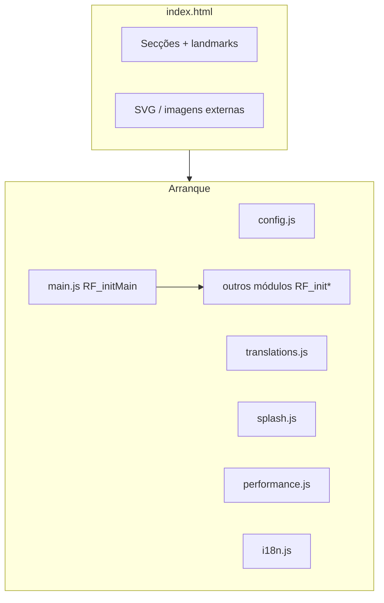

# Arquitetura e módulos

Este documento descreve como o site está montado: entrada HTML, ordem dos scripts, responsabilidades dos ficheiros e interações entre módulos.

## Visão geral

O site é **uma única página** (`index.html`). Toda a navegação entre “páginas” é feita por **âncoras** (`#sobre`, `#games`, …) e scroll.

## Ordem dos scripts (importante)

Os `<script>` no final do `body` executam **em sequência**. `main.js` chama `RF_initMain()` no `DOMContentLoaded` (ou imediatamente se o DOM já estiver pronto) e orquestra os restantes **nesta ordem**:

| Ordem | Ficheiro | Responsabilidade |
|------:|----------|------------------|
| 1 | `js/config.js` | Define `window.RF_CONFIG` (URLs, mailto, carrossel, jogos). |
| 2 | `data/translations.js` | Define `window.RF_TRANSLATIONS` (objeto aninhado `pt` / `en` / `es`). |
| 3 | `js/splash.js` | Splash `#rf-splash`; bloqueia scroll do `body` até animação/tempo mínimo. |
| 4 | `js/performance.js` | `RF_initPerformanceAndScrollVars`, `RF_isLitePerformanceMode`, `dataset.performance` no `<html>`. |
| 5 | `js/i18n.js` | `RF_I18N.init()`, aplica `data-i18n` / `data-i18n-attr`, meta, evento `rf:langchange`. |
| 6 | `js/reveal.js` | `RF_initRevealSections` — `IntersectionObserver` em `.reveal`. |
| 7 | `js/nav.js` | `RF_initNavbar` — menu, hash links, altura `--nav-h`. |
| 8 | `js/lang-selector.js` | `RF_initLanguageSelector` — troca de idioma + persistência. |
| 9 | `js/stats.js` | `RF_initStatCounters` — contadores animados. |
| 10 | `js/games.js` | `RF_initGameCards` — clones do portfólio + classe `games-carousel--marquee`. |
| 11 | `js/why-diff.js` | `RF_initWhyRainForest` — secção diferencial / scroll. |
| 12 | `js/process.js` | `RF_initProcessSection` — força modo lista na secção processo. |
| 13 | `js/main.js` | `RF_initMain` — valida traduções, chama todos os `RF_init*` acima, CTA publicação, `hashchange`. |

Se `RF_TRANSLATIONS` estiver em falta, `main.js` **aborta** e regista erro na consola — o resto dos inits não corre.

## Folhas de estilo (ordem sugerida no HTML)

1. `css/animations.css` — `@keyframes` partilhados.
2. `css/globals.css` — tokens, layout geral, secções, componentes base (ficheiro grande).
3. `css/scroll-parallax.css` — efeitos de scroll / parallax em secções específicas.
4. `css/scroll-fx-text.css` — títulos com efeito ao scroll.
5. `css/process-phase-map.css` — “Como funciona” (fundo, stack, mapa desktop no HTML ainda presente mas oculto em modo stacked).
6. `css/overrides.css` — **última camada**: carrossel de jogos (marquee), games section, ajustes finos.
7. `css/splash.css` — overlay inicial.

Regra prática: alterações “de produto” muito visíveis no carrossel ou no processo em lista → **`overrides.css`** ou **`process-phase-map.css`** para não rebentar com a especificidade de `globals.css`.

## Secções principais (`index.html`)

| `id` | Secção |
|------|--------|
| `sobre` | Sobre a Rain Forest |
| `para-quem` | Público-alvo (`.for-who`) |
| `servicos` | Serviços |
| `diferencial` | Diferenciais (`.differentials`) |
| `como-funciona` | Processo (“Como funciona”) |
| `games` | Portfólio / jogos Xbox |
| `contato` | CTA / contacto |

O `<main id="conteudo-principal">` envolve o conteúdo principal para acessibilidade.

## Carrossel de jogos (`js/games.js` + CSS)

- O marcador é **`[data-games-carousel]`** no `.games-carousel`, com viewport `.games-carousel__viewport` e track `.games-carousel__track`.
- Com **`GAMES_CAROUSEL_SPEED_PX_PER_SEC > 0`** em `config.js`, o script **duplica** todos os `a.game-card` no track (segunda metade com `tabindex="-1"` e `aria-hidden="true"`).
- O movimento contínuo é feito por **animação CSS** `translate3d(-50%, 0, 0)` na track (loop perfeito com conteúdo duplicado). A duração é `--rf-games-marquee-dur`, calculada em JS a partir da **metade da largura** da track e da velocidade em px/s. `ResizeObserver` e o evento `load` **recalculam** quando imagens lazy alteram o layout.
- Classes no root: **`games-carousel--marquee`** (ativo), **`games-carousel--out`** (fora do ecrã → `animation-play-state: paused` para poupar CPU). `IntersectionObserver` + verificação ao scroll removem `games-carousel--out` quando a faixa entra no viewport.

Velocidade **0** desliga o marquee (não adiciona clones nem classes).

## Processo “Como funciona” (`js/process.js`)

- `RF_initProcessSection` garante a classe **`process-phase--stacked`** em `#como-funciona` — lista vertical de cartões.
- O HTML ainda contém o **mapa desktop** (`.process-phase-desktop-wrap`); o CSS em `css/overrides.css` / `process-phase-map.css` oculta esse modo em favor da stack.

## Eventos úteis

| Evento | Origem | Uso típico |
|--------|--------|------------|
| `rf:langchange` | `i18n.js` após mudança de idioma | Atualizar textos injetados (ex.: CTA em `main.js`). |

## Acessibilidade (notas)

- Skip link e `aria-*` em vários blocos; carrossel com `role="region"`, `aria-roledescription="carousel"` e rótulo traduzido no viewport.
- Secções com cabeçalhos hierárquicos; `prefers-reduced-motion` é respeitado em vários sítios (ex.: duração mais longa no marquee de jogos).

## Onde não mexer sem cuidado

- **Ordem dos scripts** — `config` e `translations` têm de existir antes de `i18n` e `main`.
- **`globals.css`** — muito acoplado; preferir `overrides.css` para experimentos.
- **Clones do carrossel** — qualquer seletor “nth-child” na track pode contar o dobro dos cartões após `games.js` correr.
